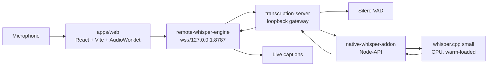

# Earth Assistant

I started this project because my parents are immigrants to the United States,
and they sometimes have difficulty communicating with others in English. I
wanted to explore whether I could build a mobile application that provides
real-time transcription during conversations and makes communication easier
for people like them. This project is the first step toward that goal, focusing
on the core speech-to-text infrastructure that a future mobile application
could build on.

Localhost live captions for **English**, **Vietnamese**, and **Spanish**. Speech
stays in its original language. Audio never leaves this computer.

This is a **two-process desktop demo**, not a public website. There is no
deployed URL a recruiter can click. The intended demo is: clone the repo, start
the local Whisper server, open the UI, and speak.

```text
Microphone → browser (16 kHz PCM) → ws://127.0.0.1:8787 → native whisper.cpp → captions
```

## Recommended environment

The setup that works best for this project — and the one to tell a recruiter to
use — is:

| Piece | Use this |
| --- | --- |
| OS | Windows 11 (or current macOS), **desktop**, not a phone |
| Runtime | **Node.js 22** (20.19+ or 24+ also work) and npm |
| Editor | **Cursor** (or VS Code) with two terminals |
| Browser | **Cursor Simple Browser** at `http://127.0.0.1:5173` |
| Alternate browser | Current **Chrome** or **Edge**, microphone allowed |
| Model | whisper.cpp **`small`** on **CPU** (default) |
| Network | None required after the first model download |

**Why Cursor’s browser:** the UI is a Chromium page that needs microphone
access, Vite’s cross-origin-isolation headers (`SharedArrayBuffer`), and a
loopback Origin the transcription server allows. Opening
`http://127.0.0.1:5173` in Cursor’s Simple Browser matches that path and is the
environment used while developing this app. Chrome and Edge work the same way
if you allow the mic. Firefox, Safari, and mobile are a poor first demo.

You need **two processes**. The web UI alone prints `local Whisper server is
unavailable`.

Do **not** use `VOICE_FAKE_RUNTIME=1` for a recruiter demo. That skips real
Whisper.

## Architecture



What each part does:

| Path | Role |
| --- | --- |
| `apps/web` | UI, microphone capture, 20 ms / 16 kHz PCM frames |
| `packages/remote-whisper-engine` | Browser client for the loopback WebSocket |
| `apps/transcription-server` | Origin check, VAD, rolling decode, one warm native handle |
| `packages/native-whisper-addon` | whisper.cpp + Silero (compile with `build:native`, not `npm install`) |
| `packages/streaming-protocol` | 656-byte PCM messages, subprotocol `voice-transcription.v1` |
| `packages/transcription-contracts` | Shared engine/session types |
| `packages/local-whisper-engine` | Optional in-browser WASM `tiny` engine (not in the shipping UI) |
| `vendor/whisper.cpp` | Pinned whisper.cpp v1.9.2 submodule |

The server binds **loopback only**. It does not persist transcripts. English-only
`.en` models are rejected.

## User guide

### Install (once)

From the repository root. Clone with submodules. Quote the path if it contains
spaces (`Tài liệu`).

```powershell
git clone --recurse-submodules <repository-url>
cd Voice-project
npm install
npm run build:native --workspace @voice/native-whisper-addon
npm run fetch-models --workspace @voice/transcription-server -- --model small
```

`npm install` downloads the browser WASM `tiny` weights (~32 MB) into
`apps/web/public/models/`. That is **not** the live model.

The live path needs a separate fetch of **`small`** (~466 MB) plus a C++ build
of the native addon. Native build requires **CMake** and a **C++17** toolchain
(Visual Studio Build Tools or LLVM on Windows).

If you cloned without submodules:

```powershell
git submodule update --init --recursive
```

### Run (every demo)

**Terminal 1 — Whisper server.** Set the env vars in the same window:

```powershell
$env:VOICE_MODEL_PATH = Join-Path (Get-Location) "apps\transcription-server\models\ggml-small.bin"
$env:VOICE_VAD_MODEL_PATH = Join-Path (Get-Location) "apps\transcription-server\models\ggml-silero-v6.2.0.bin"
npm run dev:transcribe
```

Wait until the log prints `listening on ws://127.0.0.1:8787`. That line means
weights are warm. If you see `EADDRINUSE`, port 8787 is already taken — do not
start a second server.

**Terminal 2 — UI:**

```powershell
npm run dev:web
```

**Browser:** open `http://127.0.0.1:5173` in **Cursor Simple Browser** (or
Chrome / Edge). Allow the microphone. Pick a language. Click **Start**. Speak
in a quiet room.

If Start shows `local Whisper server is unavailable`, Terminal 1 is not
listening. Leave the UI running and start the server.

### What you should see

| Step | Expected |
| --- | --- |
| Page load | Earth Assistant, language picker, Start enabled, status **Standby** |
| After Start (mic allowed) | Status **Listening**, globe active |
| While you speak | Captions appear in the transcript box and update in place |
| After you pause | The line stays as normal text (no “thinking” dots) |
| Stop | Status **Standby**, last caption remains |

A short English sentence such as “I would like to reserve a room” should
produce a close caption within about a second after you pause, on CPU `small`.
Vietnamese and accented speech are weaker on this model — see below.

## Limitations (honest)

This demo favors **privacy and a runnable local loop** over cloud ASR speed or
accuracy.

- **Speed.** Default live inference is **CPU** `small`. Captions can lag,
  especially on longer utterances. Whisper is not word-by-word streaming; the
  server re-decodes a rolling window, then finalizes after about 500 ms of
  silence.
- **Accuracy.** `small` is a mid-size model. Quiet rooms work better than
  noise. Vietnamese, Spanish, and mixed-language speech will miss or distort
  words more often than a cloud `large` or GPU `medium` setup.
- **Not a website.** There is no remote decoder. Hosting `apps/web/dist` still
  requires the loopback server on the same machine.
- **Languages.** The shipping picker is English, Vietnamese, and Spanish.
  Whisper still reports one language per utterance, not per word.
- **VAD.** Silero can split a sentence on a short pause, or wait if the room is
  noisy.
- **Not** a medical, legal, or accessibility-critical transcription product.

Latency gates we measure against (on an already-warm server): first partial
p95 ≤ 1.5 s, refresh p95 ≤ 1.0 s, final after silence p95 ≤ 1.5 s. See
[`apps/transcription-server/README.md`](apps/transcription-server/README.md).

## How to make it better

The architecture already has hooks for a stronger machine. Do not change the
code default until you have evidence the new setup still meets the latency
gates.

**1. Better GPU (speed)**

Default `build:native` is CPU. GPU is a **compile-time** whisper.cpp option
plus a runtime flag. After a CUDA or Vulkan rebuild of
`@voice/native-whisper-addon`:

```powershell
$env:VOICE_USE_GPU = "1"
npm run dev:transcribe
```

Do not set `VOICE_USE_GPU=1` on the CPU binary. Details:
[`packages/native-whisper-addon/README.md`](packages/native-whisper-addon/README.md)
and [whisper.cpp CUDA / Vulkan](https://github.com/ggml-org/whisper.cpp#nvidia-gpu-support).

**2. Better model (accuracy)**

`fetch-server-models` already knows `base`, `small` (default), and `medium`.
Point the server at the new file and **restart** it:

```powershell
npm run fetch-models --workspace @voice/transcription-server -- --model medium
$env:VOICE_MODEL_PATH = Join-Path (Get-Location) "apps\transcription-server\models\ggml-medium.bin"
npm run dev:transcribe
```

Larger models need more RAM/VRAM and can miss the latency gates on CPU. The
design intent for a GPU box is in
[`docs/superpowers/specs/2026-08-11-streaming-whisper-service-design.md`](docs/superpowers/specs/2026-08-11-streaming-whisper-service-design.md).
The shipping localhost path is
[`docs/superpowers/specs/2026-08-14-localhost-streaming-captions-design.md`](docs/superpowers/specs/2026-08-14-localhost-streaming-captions-design.md).

**3. Threads**

`VOICE_THREADS` defaults to **8**. On the reference 16-thread CPU, 8 was
faster than 14. Raise it only after measuring.

## Documentation

| Document | What it is |
| --- | --- |
| This README | Recruiter / operator entry point |
| [`CLAUDE.md`](CLAUDE.md) | Contributor map of commands and packages |
| [`apps/transcription-server/README.md`](apps/transcription-server/README.md) | Server env vars, fake runtime, benchmarks |
| [`packages/native-whisper-addon/README.md`](packages/native-whisper-addon/README.md) | Windows native build, CPU vs GPU |
| [`packages/remote-whisper-engine/README.md`](packages/remote-whisper-engine/README.md) | Browser WebSocket engine |
| [`packages/streaming-protocol/README.md`](packages/streaming-protocol/README.md) | PCM framing and loopback URL rule |
| [`packages/local-whisper-engine/README.md`](packages/local-whisper-engine/README.md) | In-browser WASM engine (not in the current UI) |
| [`docs/superpowers/specs/2026-08-14-localhost-streaming-captions-design.md`](docs/superpowers/specs/2026-08-14-localhost-streaming-captions-design.md) | Shipping live-captions design |
| [`docs/superpowers/specs/2026-08-11-streaming-whisper-service-design.md`](docs/superpowers/specs/2026-08-11-streaming-whisper-service-design.md) | GPU / multi-session direction |
| [`docs/superpowers/specs/2026-08-08-whisper-cpp-vad-migration-design.md`](docs/superpowers/specs/2026-08-08-whisper-cpp-vad-migration-design.md) | Silero VAD in the local engine |
| [`docs/superpowers/specs/2026-08-04-multilingual-realtime-transcription-design.md`](docs/superpowers/specs/2026-08-04-multilingual-realtime-transcription-design.md) | Original product shape |
| [`docs/superpowers/plans/`](docs/superpowers/plans/) | Implementation plans (historical) |
| `vendor/whisper.cpp/README.md` | Upstream whisper.cpp (submodule; do not treat as this app’s docs) |

## Commands

From the repository root:

```bash
npm install
npm run dev:web
npm run dev:transcribe
npm run build
npm test
npm run typecheck
npm run lint
npm run build:native --workspace @voice/native-whisper-addon
npm run fetch-models --workspace @voice/transcription-server -- --model small
```
